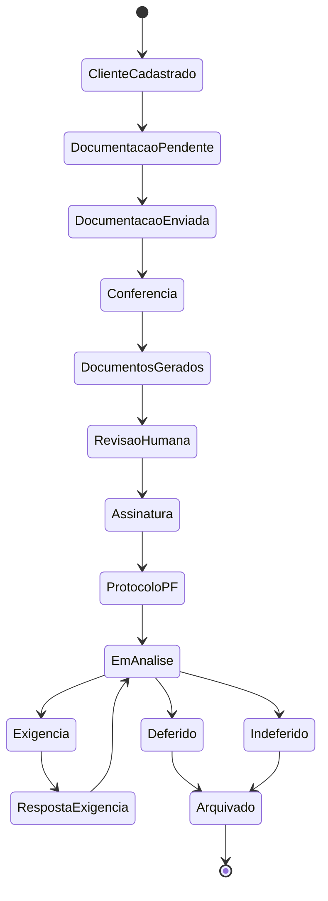

# Diagrama Do Workflow Engine

```mermaid
stateDiagram-v2
    [*] --> ClienteCadastrado
    ClienteCadastrado --> DocumentacaoPendente
    DocumentacaoPendente --> DocumentacaoEnviada
    DocumentacaoEnviada --> Conferencia
    Conferencia --> DocumentosGerados
    DocumentosGerados --> RevisaoHumana
    RevisaoHumana --> Assinatura
    Assinatura --> ProtocoloPF
    ProtocoloPF --> EmAnalise
    EmAnalise --> Exigencia
    Exigencia --> RespostaExigencia
    RespostaExigencia --> EmAnalise
    EmAnalise --> Deferido
    EmAnalise --> Indeferido
    Deferido --> Arquivado
    Indeferido --> Arquivado
    Arquivado --> [*]
```
