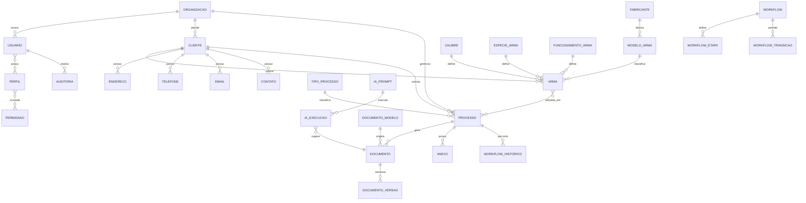

# ERD - Modelo Conceitual

## Objetivo

Representar entidades e relacionamentos do dominio sem compromisso ainda com
tipos fisicos, indices ou detalhes de Django.

## Entidades Principais

- Organizacao.
- Usuario.
- Perfil.
- Permissao.
- Cliente.
- Endereco.
- Telefone.
- Email.
- Contato.
- Arma.
- Fabricante.
- ModeloArma.
- Calibre.
- EspecieArma.
- FuncionamentoArma.
- Processo.
- TipoProcesso.
- Workflow.
- WorkflowEtapa.
- WorkflowTransicao.
- WorkflowHistorico.
- Documento.
- DocumentoModelo.
- DocumentoVersao.
- Anexo.
- Certidao.
- IaPrompt.
- IaExecucao.
- Auditoria.
- Notificacao.
- Tarefa.
- Agenda.
- Financeiro.

## Relacionamentos Conceituais

