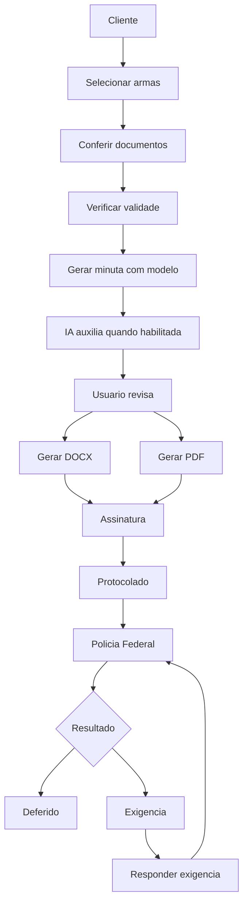

# Fluxo: Renovacao

```mermaid
flowchart TD
    A[Cliente] --> B[Selecionar armas]
    B --> C[Conferir documentos]
    C --> D[Verificar validade]
    D --> E[Gerar minuta com modelo]
    E --> F[IA auxilia quando habilitada]
    F --> G[Usuario revisa]
    G --> H[Gerar DOCX]
    G --> I[Gerar PDF]
    H --> J[Assinatura]
    I --> J
    J --> K[Protocolado]
    K --> L[Policia Federal]
    L --> M{Resultado}
    M --> N[Deferido]
    M --> O[Exigencia]
    O --> P[Responder exigencia]
    P --> L
```
